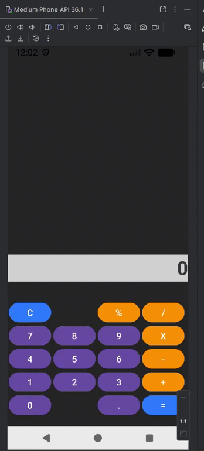

# Calculadora Android - Java 🧮

Este é um projeto de uma calculadora científica funcional desenvolvida para Android utilizando a linguagem **Java**. O aplicativo foi construído com foco em boas práticas de UI/UX, utilizando `GridLayout` para um design responsivo e a biblioteca `exp4j` para o processamento de expressões matemáticas complexas.

## 🚀 Funcionalidades

* **Cálculos em Tempo Real:** Processamento de expressões matemáticas completas (soma, subtração, multiplicação e divisão).
* **Tratamento de Erros Inteligente:** Identificação e tratamento de divisões por zero e erros de sintaxe (ex: "5++5") para evitar travamentos do app.
* **Interface Adaptável:** Uso de `GridLayout` para garantir que os botões se ajustem corretamente a diferentes tamanhos de tela.
* **Design Moderno:** Botões estilizados com `Material Design`, utilizando `backgroundTint` e `cornerRadius` para um visual arredondado e limpo.
* **Lógica de Visor Inteligente:** O visor limpa automaticamente mensagens de erro quando o usuário inicia uma nova digitação.



## 🛠️ Tecnologias e Bibliotecas

* **Linguagem:** Java.
* **IDE:** Android Studio (Gradle Kotlin Script - `.kts`).
* **Layout:** XML com `GridLayout` e `Material Components`.
* **Processamento Matemático:** [exp4j](https://www.objecthunter.net/exp4j/) - Biblioteca para avaliação de expressões matemáticas.


## 📖 Aprendizados Técnicos

Neste projeto, apliquei conceitos avançados de desenvolvimento mobile:

1.  **Gerenciamento de Dependências:** Configuração e sincronização de bibliotecas externas via Gradle.
2.  **Lógica de Concatenação:** Implementação de um método unificado (`pressButton`) para capturar textos de múltiplos botões e gerenciar o estado do visor.
3.  **Tratamento de Exceções:** Uso de blocos `try-catch` e verificações da classe `Double` (`isInfinite` e `isNaN`) para garantir a estabilidade da aplicação.
4.  **UX no Mobile:** Normalização de símbolos (substituindo "X" visual por "*" lógico) para facilitar a interpretação do motor de cálculo.


## ⚙️ Como executar o projeto

1.  **Clone o repositório:**
    ```bash
    git clone [https://github.com/RafaelDesenvolvedor1/CalculadoraJava.git](https://github.com/RafaelDesenvolvedor1/CalculadoraJava.git)
    ```
2.  Abra no **Android Studio**.
3.  Certifique-se de realizar o **Gradle Sync** para baixar a biblioteca `exp4j`.
4.  Execute em um emulador ou dispositivo físico (API 24+ recomendada).

## 🤝 Créditos

Desenvolvido por **Rafael Santos**.
* **GitHub:** [RafaelDesenvolvedor1](https://github.com/RafaelDesenvolvedor1).